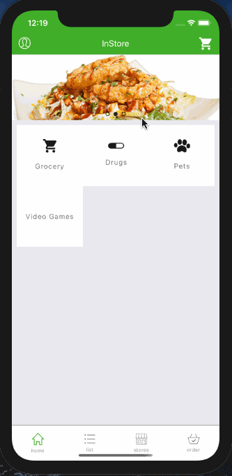
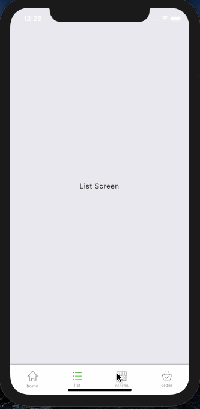

# InStore

## User Stories

The following functionality is completed and depicted in the Walkthrough:

- [x] Create a Splash Screen and add **Animation** to it.
- [x] User can **Log in using oAuth**
- [x] Create a **JWT (JSON Web Token)** to create an encryption signature to store private data
- [x] **AsyncStorage** is used to store the JWT into the user device's cache to skip sign-in process for returning users
- [x] **Google Autocomplete** functionality using **Places API** to input user provided address data.
- [x] Use of **MobX** to manage the state of the application using a global store and local state management
- [x] Use of **MobX** to observe changes to state
- [x] Use **lodash** to 'get' functions for common programming tasks using a **functional programming paradigm**
- [x] Use **MobX-State-Tree** to manage the state of the application as middleware
- [x] Use **MobX-State-Tree** to leverage **MVC paradigm**
- [x] Use **Animations** for deleting items from the shopping cart screen.
- [x] Create basic **log out functionality**
- [x] Allow updating of shopping cart item quantity from the grocery list
- [x] Allow updating of shopping cart item quantity from the shopping cart (not depicted in walkthrough)
- [x] Use **MongoDB Atlas** for handling data for the Customer as well as Addresses.
- [x] Update price of shopping cart order based on item cost and quantity allocated to the cart in real time (not depicted in walkthrough)
- [ ] ...incoming

The following features are left to be resolved:

- [x] Logging out of the app should 'reset' the stores
- [ ] App state should be managed consistently. Current app has local state managed by React state management techniques as well as MobX decorators
- [ ] Testing can be implemented to make debugging easier
- [ ] EditAddressScreen does not edit delivery options or apt on the front end, may possible update aforementioned data on the back end
- [ ] The JWT never goes out of scope, except on log out, it should expire after an elapsed timeframe
- [ ] Update Walkthrough (below) to depict changes not yet depicted

The following could be improved:
- [ ] Logging out of the app should 'reset' the stores using MobX-State-Tree snapshots

Nice to have or look more into for either this project or a future project:
- [ ] Type checking using **TypeScript**
- [ ] **GraphQL with Apollo**
- [ ] **Stripe API**
- [ ] Update the navigation from **React-Navigation** 2.x to 5.2
- [ ] Rebuild the app as a Bare app, it is currently a Managed Expo build
- [ ] Possbily move the Server side from **SaaS** to **AWS**
- [ ] Create an option for native Light/Dark theme modes
- [ ] 

## Video Walkthrough

Here's a walkthrough of implemented user stories:

Here's a walkthrough of slightly less interesting functionality:

